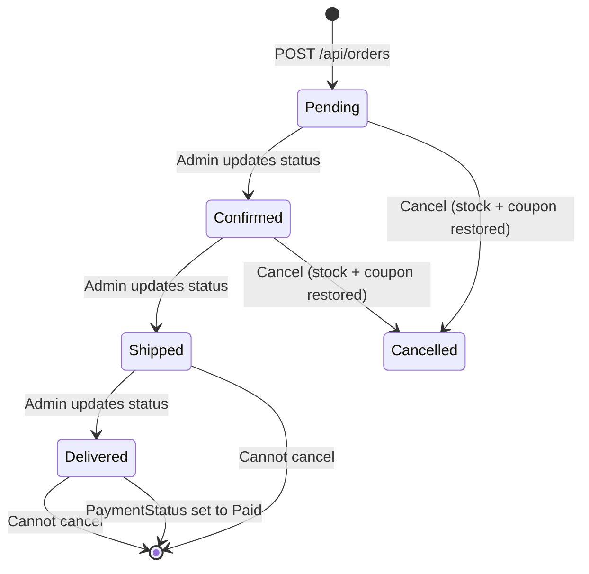

# Elshima E-Commerce API

A production-ready **ASP.NET Core 8** backend for **Elshima** — an Egyptian women's Islamic clothing store. The API serves two frontend systems:

- **Admin Dashboard** — product, order, coupon, discount, and category management
- **Store Frontend** — customer-facing shopping experience

---

## Tech Stack

| Layer | Technology |
|---|---|
| Framework | ASP.NET Core 8 Web API |
| ORM | Entity Framework Core 8 (SQL Server) |
| Identity | ASP.NET Core Identity |
| Mapping | AutoMapper |
| Auth | JWT Bearer + Refresh Token rotation |
| Architecture | Clean (Onion) Architecture |
| Patterns | Repository, Unit of Work, Specification |
| Background Jobs | IHostedService (CartCleanupService) |

---

## Architecture

```
┌──────────────────────────────────────────────┐
│         Elshima.Web  (Entry Point)           │
│   Program.cs · Middleware · BackgroundSvc    │
└────────────────────┬─────────────────────────┘
                     │
┌────────────────────▼─────────────────────────┐
│      Elshima.Presentation  (Controllers)     │
│   Products · Orders · Auth · Cart · ...      │
├──────────────────────────────────────────────┤
│     Elshima.Persistence  (Infrastructure)    │
│   EF Configurations · UnitOfWork · Repos     │
└──────────────┬───────────────────────────────┘
               │
┌──────────────▼───────────────────────────────┐
│        Elshima.Service  (Application)        │
│   Services · AutoMapper Profiles · Resolvers │
├──────────────────────────────────────────────┤
│      Elshima.Abstruction  (Interfaces)       │
│    IServices · IPictureUrlResolver · IUoW    │
├──────────────────────────────────────────────┤
│         Elshima.Domain  (Core)               │
│  Entities · Exceptions · Specs · Helpers     │
├──────────────────────────────────────────────┤
│          Elshima.Shared  (DTOs)              │
│   Request / Response DTOs · PaginationParams │
└──────────────────────────────────────────────┘
```

**Dependency rule**: Outer layers depend on inner layers only. `Elshima.Domain` has zero EF Core, ASP.NET, or AutoMapper references.

---

## Business Modules

### Auth
- Service: `AuthService` | Controller: `AuthController`
- JWT access token (configurable expiry, default 24h) + rotating Refresh Token (7 days, stored in DB)
- Login, Register, Logout, Change Password, Forgot Password, Reset Password
- Refresh token revocation on logout and password change
- Password policy: digit + lowercase + uppercase + non-alphanumeric, min 8 chars, unique email

### Categories
- Service: `CategoryService` | Controller: `CategoriesController`
- Arabic name + auto-generated URL slug (regenerated only on name change)
- Category-level discount (Percentage or FixedAmount) with date range
- Inline image upload via `POST /api/categories/with-image` (magic bytes validated)
- Soft delete via global EF query filter

### Products
- Service: `ProductService` | Controller: `ProductsController`
- Full product aggregate: `Product → Colors → Images + Variants`
- Product-level discount overrides category discount (see PricingHelper)
- Dedicated listing display images (`ProductDisplayImage`, separate from color images)
- `ListingMainImageUrl` (SortOrder 0) and `ListingHoverImageUrl` (SortOrder 1) for product cards
- `MainImageUrl` derived from default color's main image (backward-compatible)
- Slug generation: Arabic name + UUID suffix
- Auto-increment view count on detail page requests
- Admin: create, update, delete, batch create, create with image upload
- Public: paginated listing with full filtering, featured products, related products

### Cart
- Service: `CartService` | Controller: `CartController`
- Per-user cart auto-created on first item add
- Stock checked on every add/update
- Cart cleanup: items older than 7 days deleted hourly by `CartCleanupService`

### Orders
- Service: `OrderService` | Controller: `OrdersController`
- Guest checkout supported (no token required for `POST /api/orders`)
- Order number format: `ORD-yyyyMMdd-XXXXXXXX`
- Full coupon application at checkout (validation + usage tracking)
- Stock decremented on create, restored on cancel
- Coupon `UsedCount` decremented and `CouponUsage` record deleted on cancel
- Cancellation blocked after `Shipped` or `Delivered` status
- Order tracking by phone + order number (no auth required)

### Discounts
- Service: `DiscountService` | Controller: `DiscountsController`
- Admin-only CRUD on `Discount` entities
- Two target types: `Product` or `Category`
- Soft delete applied

### Coupons
- Service: `CouponService` | Controller: `CouponsController` (in `DiscountsController.cs`)
- Admin-only management; public validate endpoint (no auth)
- Validation order: existence → IsActive → date range → UsageLimit → MinimumOrderAmount → per-user usage
- `MaximumDiscountAmount` cap applied after discount computation

### Promotions (Cart-Level Engine)
- Service: `PromotionService` | Handlers: Strategy pattern (`IPromotionHandler`)
- 4 promotion types: `Percentage`, `Fixed`, `BuyXGetY`, `FreeShipping`
- 3 scopes: `Product`, `Category`, `Cart`
- Conflict resolution: `Priority` (descending) → alphabetical `Name` (tie-break)
- `IsStackable = false` stops further promotions from applying
- `AllowCouponStacking = false` blocks coupon usage alongside the promotion
- Calculations always on `BasePrice` (never on discounted `UnitPrice`) to prevent double discounts
- Every `CartResponse` passes through `PromotionService.ApplyAsync()` before reaching the API
- New types require only: a new enum value + a new Handler class

### Users & Addresses
- Service: `UserService` | Controller: `UsersController`
- `GET /api/users/me` returns current authenticated user info
- Address CRUD with default address management
- Single user can have multiple addresses; one can be default

### Governorates
- Service: `GovernorateService` | Controller: `GovernoratesController`
- List of Egyptian governorates with base shipping cost per governorate
- Admin can update shipping costs dynamically

### Images
- Controller: `ImagesController` (Admin only)
- Full validation pipeline: size → extension whitelist → magic bytes → GUID filename → path traversal check
- Returns relative path `products/{filename}`, resolved to full URL by `IPictureUrlResolver`

---

## Database Design

```mermaid
erDiagram
    Product {
        Guid Id PK
        string NameAr
        string Slug
        decimal BasePrice
        Guid CategoryId FK
        Guid SizeTypeId FK
        bool IsDeleted
    }
    ProductColor {
        Guid Id PK
        Guid ProductId FK
        Guid ColorId FK
        bool IsDefault
    }
    ProductColorImage {
        Guid Id PK
        Guid ProductColorId FK
        string ImageUrl
        bool IsMain
        int DisplayOrder
    }
    ProductVariant {
        Guid Id PK
        Guid ProductColorId FK
        Guid SizeId FK
        int AvailableQuantity
        byte[] RowVersion
    }
    ProductDisplayImage {
        Guid Id PK
        Guid ProductId FK
        string ImageUrl
        int SortOrder
        string AltText
    }
    Category {
        Guid Id PK
        string NameAr
        string Slug
        bool IsDeleted
    }
    Order {
        Guid Id PK
        string OrderNumber
        Guid? UserId FK
        string CustomerPhone
        OrderStatus Status
        decimal TotalAmount
    }
    OrderItem {
        Guid Id PK
        Guid OrderId FK
        Guid? ProductVariantId FK
        decimal UnitPrice
        int Quantity
    }
    Coupon {
        Guid Id PK
        string Code
        int UsedCount
        int? UsageLimit
    }
    ShoppingCart {
        Guid Id PK
        Guid UserId FK
    }
    CartItem {
        Guid Id PK
        Guid CartId FK
        Guid? ProductVariantId FK
        int Quantity
    }

    Product ||--o{ ProductColor : has
    ProductColor ||--o{ ProductColorImage : has
    ProductColor ||--o{ ProductVariant : has
    Product ||--o{ ProductDisplayImage : has
    Category ||--o{ Product : contains
    Order ||--o{ OrderItem : contains
    ShoppingCart ||--o{ CartItem : contains
```

**Key rules:**
- All entities inherit `BaseEntity` with `Id (Guid)`, `CreatedAt`, `UpdatedAt`
- Soft delete via `IsDeleted` flag + EF Core global query filters on `Product`, `Category`, `Discount`
- `ProductDisplayImage` query filter: `!img.Product.IsDeleted`
- `ProductVariant.RowVersion` configured for optimistic concurrency
- `FinalPrice` is **never stored** — always computed dynamically by `PricingHelper`

---

## Product System

```
Product
├── BasePrice
├── DiscountType / DiscountValue / IsDiscountActive (product-level)
├── DisplayImages[]          ← homepage/listing images (NEW)
│   ├── SortOrder 0          ← ListingMainImageUrl
│   └── SortOrder 1          ← ListingHoverImageUrl
└── Colors[]
    ├── Color (ref)
    ├── IsDefault
    ├── Images[]             ← detail page gallery (ProductColorImage)
    │   ├── IsMain
    │   └── DisplayOrder
    └── Variants[]
        ├── Size (ref)
        ├── AvailableQuantity
        └── PriceOverride?
```

### Pricing Priority (`PricingHelper`)
1. **Product discount** (if `IsDiscountActive && within date range`)
2. **Category discount** (fallback when no active product discount)
3. No discount → `FinalPrice = BasePrice`

Both `Percentage` and `FixedAmount` types supported. `FinalPrice` is always `≥ 0`.

### Display Images vs Color Images

| Field | Entity | Used In |
|---|---|---|
| `ListingMainImageUrl` | `ProductDisplayImage` SortOrder 0 | Product card (listing) |
| `ListingHoverImageUrl` | `ProductDisplayImage` SortOrder 1 | Product card hover |
| `MainImageUrl` | Default color's `IsMain` image | Legacy fallback |
| `Colors[].Images[]` | `ProductColorImage` | Detail page gallery |

### Slug Generation
- Pattern: `arabic-name-{8-char-uuid}`
- Generated on: create, or when name changes (not on every update)
- Applied to both `Product` and `Category`

---

## Images System

### Upload Security Pipeline
1. **Null / size check** — max 5 MB (`FileValidationHelper.IsFileSizeAllowed`)
2. **Extension whitelist** — `.jpg`, `.jpeg`, `.png`, `.webp`, `.gif`
3. **Magic bytes check** — validates actual binary signature (JPEG, PNG, GIF, WebP RIFF)
4. **Stream reset** — `stream.Position = 0` after magic bytes so the write sees all bytes
5. **Safe filename** — `Guid.NewGuid().ToString("N") + extension` (no user-supplied names)
6. **Path traversal guard** — `Path.GetFullPath` vs `uploadsRoot` prefix check

> Upload endpoints return a **relative path** (e.g. `products/abc123.jpg`).
> `IPictureUrlResolver` builds the full URL at read time: `{BaseUrl}/images/{path}`.

### `IPictureUrlResolver` — Centralized URL Building
Implemented by `PictureUrlResolverService`. Strips any leading `/images/` prefix or `/` from stored paths to prevent double-prefix. Reads `Urls:BaseUrl` from configuration.

All image fields in API responses go through AutoMapper resolvers that call `IPictureUrlResolver.Resolve()`:
- `PictureUrlResolver` → `MainImageUrl`
- `ProductColorImageUrlResolver` → `Colors[].Images[].ImageUrl`
- `CategoryImageUrlResolver` → category `ImageUrl`
- `CartItemImageUrlResolver` → cart item image
- `DisplayImageUrlResolver` → `DisplayImages[].ImageUrl`
- `ListingMainImageUrlResolver` → `ListingMainImageUrl`
- `ListingHoverImageUrlResolver` → `ListingHoverImageUrl`

---

## Order Lifecycle



**Cancellation rules:**
- Customer or Admin can cancel `Pending` / `Confirmed` orders
- `Shipped` and `Delivered` orders **cannot** be cancelled
- On cancel: `AvailableQuantity` restored per variant, `Coupon.UsedCount` decremented, `CouponUsage` record deleted

---

## Security Design

### JWT + Refresh Token
- Access token: HS256 signed, configurable expiry (default 24h)
- Refresh token: 7-day lifetime, stored in DB, single-use rotation
- All active refresh tokens revoked on logout or password change

### Roles
| Role | Access |
|---|---|
| Admin | Full management: products, orders, coupons, discounts, images |
| Customer | Personal orders, cart, addresses |
| Guest | Create order, validate coupon, track order |

### Rate Limiting (Fixed Window)
| Policy | Limit | Window | Applied To |
|---|---|---|---|
| `auth` | 5 req | 1 min | Login, Register, Forgot/Reset Password |
| `general` | 30 req | 1 min | General endpoints |
| `guest` | 10 req | 1 min | Order tracking |

### CORS
- **Development**: `AllowAll` (any origin)
- **Production**: `Production` policy — restricted to `Cors:AllowedOrigins`

### Exception → HTTP Status Mapping
| Exception | HTTP |
|---|---|
| `NotFoundException` | 404 |
| `DuplicateEntityException` | 409 |
| `DomainValidationException` | 400 |
| `InvalidDomainOperationException` | 400 |
| `InsufficientStockException` | 400 |
| `UnauthorizedAccessException` | 401 |

---

## Configuration & Running

### Prerequisites
- .NET 8 SDK
- SQL Server (local or remote)
- dotnet-ef tool: `dotnet tool install -g dotnet-ef`

### Setup

```bash
# 1. Clone
git clone <repo-url>
cd ElshimaSolution

# 2. Set secrets (NEVER put real values in appsettings.json)
cd Elshima.Web
dotnet user-secrets set "ConnectionStrings:DefaultConnection" "Server=...;Database=ElshimaDB;..."
dotnet user-secrets set "Jwt:Secret" "your-32+-char-secret-here"
dotnet user-secrets set "Urls:BaseUrl" "https://localhost:7208"

# 3. Apply migrations
cd ..
dotnet ef database update --project Infrastructure\Elshima.Persistence --startup-project Elshima.Web

# 4. Run
dotnet run --project Elshima.Web

# 5. Swagger UI
# Navigate to https://localhost:7208/swagger
```

> ⚠️ **Never put real secrets in `appsettings.json`**. The file contains placeholder values. Use `dotnet user-secrets` for local development and environment variables for production.

---

## API Response Structure

All responses use a standard `ApiResponse<T>` envelope:

```json
{
  "success": true,
  "message": "تم الإنشاء بنجاح",
  "data": { },
  "errors": null
}
```

Paginated responses (`PaginatedResponse<T>`):

```json
{
  "success": true,
  "message": null,
  "data": {
    "items": [...],
    "totalCount": 120,
    "pageNumber": 1,
    "pageSize": 10,
    "totalPages": 12
  }
}
```

`PageSize` is capped at **50** server-side regardless of what the client sends.
